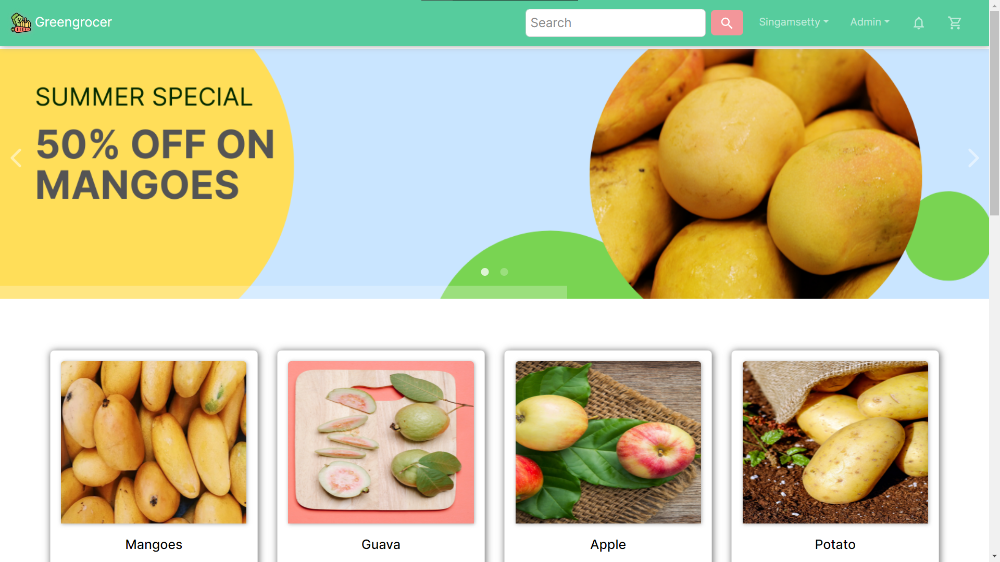

<p align='center'>
 
</p>
<h1 align='center'> Greengrocer</h1>
<p align='center'>
<b>An E-commerce  web-app</b>
</p>
<p align='center'>
<a href='https://greengrocer.vercel.app' target='_blank'>greengrocer.vercel.app</a>
</p>

---

<p align='center'>
This is the frontend of Greengrocer deployed with
<a href='https://vercel.com/' target='_blank'>Vercel</a>
</p>

<p align='center'>

</p>


## 🚀 Link to [Backend](https://github.com/Dhanush1509/greengrocer-api)


## 🧾 Description

Greengrocer is an E-commerce platform for small bussiness owners who want to expand their bussiness by providing an online purchase solution to their customers.

## ✨ Features

#### Client

Users shopping through this platform enjoys following features:

- [x] User authentication through a verified mail (service offered by Razorpay).
- [x] Secure payments via Razorpay.
- [x] Users can change their Name.
- [x] Users will be notified by mail when new product is purchased.
- [x] Users will receive updates through chat.
- [x] Users can order products by providing their shipping information and card details for payments.
- [x] Users can view their order's status and their previous orders.
- [x] Users can chat with admin.
- [x] Users can add their favourite products to wishlist
- [x] Responsive for all screen sizes.

#### Admin

The admin panel has the following features:


- [x] Can view, create, update,verify and delete users.
- [x] Can view, create, update, and delete products.
- [x] Can view orders and update their status.
- [x] Can chat with all users


## ⚙ Tools and Technologies used

#### Client

1. [React.js](https://reactjs.org/)
2.  [Razorpay](https://razorpay.com/)
3. [MomentJS](https://momentjs.com/)
4. [Socket.io-client](https://socket.io/)
5. [Material UI](https://v4.mui.com/)
6. [React Bootstrap](https://react-bootstrap.github.io/)


#### [Backend](https://github.com/Dhanush1509/greengrocer-api)

1. [Node.js](https://nodejs.org/en/)
2. [Express.js](https://expressjs.com/)
3. [MongoDB](https://www.mongodb.com/)
4. [JWT](https://jwt.io/)
5. [Bcrypt.js](https://github.com/dcodeIO/bcrypt.js)
6. [Razorpay](https://razorpay.com/)
7. [Sendgrid](https://sendgrid.com/)
8. [Socket.io-server](https://socket.io/)

## 🛠 Installation and setup

1. Clone the repo to your local machine.
2. Install the required dependency for server using :

   ```javascript
   npm install
   ```

3. Create a .env file inside the root folder and provide the following environment variables:

   ```env
        REACT_APP_URL=<remote-api-url>
        REACT_APP_DEV_URL=<local-api-url> 
        REACT_APP_CLIENT_URL=<remote-app-url>
        REACT_APP_RAZORPAY_KEY_ID=<razorpay-key-id>
   ```

4. Start the dev server using :

   ```javascript
   npm start
   ```

## 🏎 Creating production built

1. Create a production ready react app using the command :

   ```javascript
   npm run build
   ```

## 🤝  Test admin user credentials

If you want to test Admin page drop a mail at <a href="mailto:s.munidhanush15@gmail.com" target="_blank">s.munidhanush15@gmail.com</a>

NOTE: These are just for testing purpose. Please don't:

1. Update or delete an existing product.
2. Delete product reviews.
3. Create new admin users.
4. Delete existing admin users.

For testing out things, you can create a new product, try out things and after that delete the product that you created.


#### Readme Credits: <a href="https://github.com/varunKT001">varunKT001</a>


##  Made with 💖 by <a href="https://github.com/Dhanush1509">Singamsetty Munidhanush</a>
