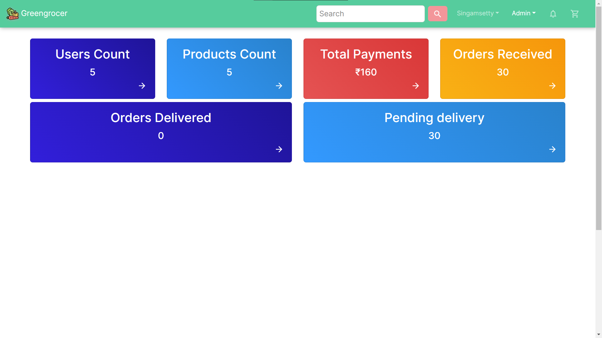

## Homepage

## Products page

## Single product page

## Profile Page

## Wishlist page

## Empty Cart Page

## Cart Page

## Payment Page

## Orders page

## Single order page

## Paid Order Page

# Admin

## Admin Page

## users Page

## get User Page

## Update User Page

## delete User Page

## Products page

## Create product page

## Orders page

## Chat Page

